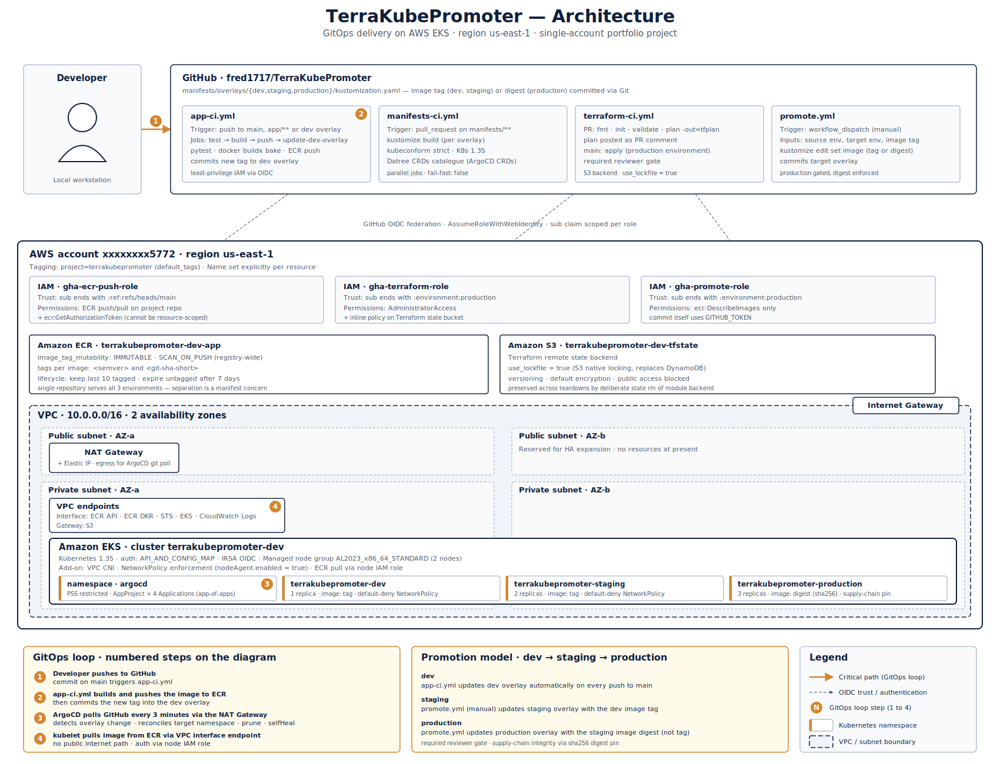

## 0. Project overview

**TerraKubePromoter** is a portfolio project demonstrating a GitOps deployment platform on AWS EKS.

The project delivers 2 components:
- a platform: EKS cluster provisioned via Terraform, with ArgoCD installed for continuous reconciliation
- a workload: a lightweight Flask API exposing `/health`, `/ready`, and `/version` endpoints

**Architecture**
- Infrastructure provisioning: Terraform (modular layout, S3 remote state with native locking)
- Container registry: ECR with `IMMUTABLE` tags and registry-wide vulnerability scanning
- Workload manifests: Kustomize base + 3 environment overlays (dev, staging, production)
- GitOps delivery: ArgoCD with an app-of-apps bootstrap pattern
- CI/CD: 4 GitHub Actions workflows authenticated via GitHub OIDC federation to AWS

**Promotion model**
- 3 environments, each in its own Kubernetes namespace with least-privilege RBAC, ResourceQuota, NetworkPolicy, and Pod Security Standards `restricted` profile
- Image promotion happens exclusively via Git commits to the overlay `kustomization.yaml`
- Production references the image by digest (`@sha256:...`), not by tag, for supply-chain integrity
- ArgoCD reconciles every 3 minutes; manual cluster changes are reverted by `selfHeal`, deleted resources are restored by `prune`

**Portfolio narrative**
"Infrastructure is provisioned by Terraform, workloads are delivered by Git, and nothing runs that is not defined in code."

**Architecture diagram**
The full architecture is captured in `docs/diagrams/terrakubepromoter-architecture.svg`.



The diagram covers:
- the developer workstation and the GitHub repository, with the 4 GitHub Actions workflows
- GitHub OIDC federation into 3 least-privilege IAM roles in the AWS account
- ECR (immutable tags, registry-wide scanning) and the S3 backend bucket for Terraform state
- the VPC layout (2 availability zones, public and private subnets, NAT Gateway, Internet Gateway, VPC endpoints)
- the EKS cluster, with the `argocd` namespace and the 3 workload namespaces (dev, staging, production)
- the 4-step GitOps loop, the promotion model, and a legend
**Scope boundaries**
- Out of scope: progressive delivery (Argo Rollouts), SSO, public ingress, multi-cluster
- Single AWS region: `us-east-1`
- Single AWS account: `180294215772`

**Commit `docs/diagrams/terrakubepromoter-architecture.svg` to GitHub**
```bash
COMMIT_MSG="docs: add architecture diagram and reference it in README section 0"
git add docs/diagrams/terrakubepromoter-architecture.svg README.md
git commit -m "${COMMIT_MSG}"
git push origin main
```


## 1. Repository

The project is hosted on GitHub at:
https://github.com/fred1717/TerraKubePromoter

**Repository structure**
A high-level tree is maintained in `docs/repository_structure.md`.

**Architecture Decision Records**
Decision records are stored in `docs/ADR/`.


## 2. Terraform infrastructure
The Terraform layer provisions every AWS resource the platform depends on.

### 2.1 Scope
The Terraform track delivers:
- remote state backend: S3 bucket with native locking (`use_lockfile = true`)
- VPC: 2 availability zones, public and private subnets, Internet Gateway, single NAT gateway
- VPC endpoints: ECR API, ECR DKR, STS, EKS, CloudWatch Logs (interface) and S3 (gateway)
- EKS cluster: control plane, managed node group on `AL2023_x86_64_STANDARD`, OIDC provider for IRSA
- IAM: cluster role, node group role, AWS-managed policies only
- ECR: single repository with `IMMUTABLE` tags, lifecycle policy, registry-wide vulnerability scanning
- Tagging: `default_tags` on the AWS provider plus an explicit `Name` tag per resource


### 2.2 Module layout
Each module contains its own `main.tf`, `variables.tf`, and `outputs.tf`.

Modules under `terraform/modules/`:
- `backend`: S3 bucket for remote state
- `vpc`: VPC and Internet Gateway
- `subnets`: public and private subnets
- `route_tables`: public and private route tables, associations, default routes
- `nat`: Elastic IP, NAT gateway, NAT-bound private route
- `security_groups`: security groups and ingress rules
- `endpoints`: VPC interface and gateway endpoints
- `iam_roles`: EKS cluster and node group roles, trust policy documents
- `iam_policies`: AWS-managed policy attachments
- `oidc`: EKS IRSA and GitHub Actions OIDC providers
- `eks`: EKS cluster, managed node group, access entries
- `eks_addons`: VPC CNI add-on with NetworkPolicy enforcement
- `ecr`: ECR repository and lifecycle policy
- `ecr_scanning`: registry-wide scanning configuration
- `argocd`: ArgoCD Helm release and namespace
- `cicd_iam_roles`: 3 IAM roles for GitHub Actions (`gha-ecr-push-role`, `gha-terraform-role`, `gha-promote-role`)


### 2.3 Key decisions
**Backend state locking**
S3 native locking via `use_lockfile = true` replaces deprecated DynamoDB locking.

**Network egress**
A single NAT gateway provides outbound internet access for ArgoCD's GitHub polling.
VPC endpoints handle every AWS service the cluster reaches.

**EKS authentication**
`authentication_mode = "API_AND_CONFIG_MAP"` supports both EKS access entries and the legacy `aws-auth` ConfigMap.

**Node group AMI**
`AL2023_x86_64_STANDARD`: Amazon Linux 2 is no longer supported on Kubernetes 1.33 and above.

**ECR repository topology**
A single repository serves all 3 environments.
Environment separation is a Kubernetes manifest concern, not a registry concern.

**ECR tag strategy**
Every image carries 2 tags: `<semver>` (for example `0.1.3`) and `<git-sha-short>` (for example `a1b2c3d`).
Tags are `IMMUTABLE`.

**ECR lifecycle policy**
The last 10 tagged images are retained; untagged images expire after 7 days.

**Tagging**
The `project` tag is propagated through `default_tags` on the AWS provider.
The `Name` tag is set explicitly per resource, as `default_tags` does not cover it.


### 2.4 Provider and Terraform versions
- Terraform: `>= 1.14.0, < 2.0.0`
- AWS provider: `~> 6.0`
- TLS provider: `~> 4.0` (required by the EKS module's `tls_certificate` data source)
- Helm provider: required by the `argocd` module
- Kubernetes provider: required by the `argocd` module

The `.terraform.lock.hcl` file pins exact provider versions.


### 2.5 Inputs
Root variables are defined in `terraform/variables.tf`.
Values are supplied via `terraform.tfvars` (excluded from version control by `.gitignore`).
A documented baseline is committed as `terraform.tfvars.example`.


### 2.6 Outputs
Root outputs surface:
- the EKS cluster name and endpoint
- the ECR repository URL and ARN
- the 3 GitHub Actions IAM role ARNs (`gha_ecr_push_role_arn`, `gha_terraform_role_arn`, `gha_promote_role_arn`)
- the OIDC provider ARNs


## 3. Application
The workload is a lightweight Flask API serving 3 endpoints:
- `GET /health`: liveness probe, returns `{"status": "healthy"}`
- `GET /ready`: readiness probe, returns `{"status": "ready"}`
- `GET /version`: returns the image version and git SHA, sourced from environment variables injected at container build time


### 3.1 Source layout
Located in `app/`:
- `src/main.py`: Flask application
- `src/__init__.py`: package marker
- `tests/test_main.py`: unit tests with `pytest`
- `requirements.txt`: runtime dependencies, hash-pinned
- `requirements-dev.txt`: test dependencies, hash-pinned
- `pyproject.toml`: project metadata and `pytest` configuration
- `Dockerfile`: multi-stage build
- `.dockerignore`
- `docker-bake.hcl`: build configuration consumed by `docker buildx bake`
- `VERSION`: source of truth for the semantic version tag


### 3.2 Runtime stack
- Python 3.13 (`python:3.13-slim` base image, pinned by SHA256 digest)
- Flask 3.1.3 as the web framework
- gunicorn 25.3.0 as the WSGI server, bound to `0.0.0.0:8000`


### 3.3 Container image
**Base image**
`python:3.13-slim`, pinned by SHA256 digest.

**Build**
Multi-stage Dockerfile:
- stage 1 (`builder`): installs dependencies into a virtual environment
- stage 2 (`runtime`): copies the virtual environment and source code only

**User**
A non-root user `appuser` with UID 10001 is created inside the image.

**Build configuration**
`app/docker-bake.hcl` codifies:
- `--provenance=false` and `--sbom=false` (single-platform manifests are ECR-scannable)
- build arguments: `APP_VERSION` and `GIT_SHA`
- platform: `linux/amd64` (matches the EKS node group AMI type `AL2023_x86_64_STANDARD`)
- tags: local image tag only; the ECR-specific tag is applied separately via `docker tag`, keeping the bake file registry-agnostic

**Runtime entry point**
`gunicorn` serves the application; the Flask development server is not used in production.


### 3.4 Image tagging strategy
Every image receives 2 tags:
- `<semver>`, sourced from `app/VERSION` (for example `0.1.3`)
- `<git-sha-short>` (for example `a1b2c3d`)

Tags are `IMMUTABLE` at the ECR level.


### 3.5 Tests
Unit tests run with `pytest`, using the Flask test client (in-process WSGI calls, no live HTTP).
3 tests cover the 3 endpoints.


### 3.6 Container registry
The image is pushed to ECR.
ECR registry-wide scanning (`SCAN_ON_PUSH`) is enabled at account level via the `ecr_scanning` Terraform module.
Scan findings are queryable through `aws ecr describe-image-scan-findings`.


## 4. Kubernetes manifests
The workload is deployed via Kustomize.
Manifests are organised as a shared base plus 3 environment overlays.

### 4.1 Layout
Located in `manifests/`:
- `base/`: namespace-agnostic workload definition
- `overlays/dev/`, `overlays/staging/`, `overlays/production/`: per-environment configuration
- `components/networkpolicy/`: shared Kustomize component referenced by every overlay

**Base resources**
- `deployment.yaml`
- `service.yaml`
- `serviceaccount.yaml`
- `role.yaml`
- `rolebinding.yaml`
- `kustomization.yaml`

**Per-overlay resources**
- `namespace.yaml`
- `resourcequota.yaml`
- `kustomization.yaml`

The `NetworkPolicy` set is defined once in `components/networkpolicy/` and referenced by every overlay via the `components` field, eliminating duplication across environments.


### 4.2 Environments
Each environment runs in its own namespace:
- `terrakubepromoter-dev`: 1 replica
- `terrakubepromoter-staging`: 2 replicas
- `terrakubepromoter-production`: 3 replicas


### 4.3 Image reference
- dev and staging: image tag (`<repository>:<semver>`)
- production: image digest (`<repository>@sha256:<64-hex>`), for supply-chain integrity


### 4.4 Security baseline
**Pod Security Standards**
The `restricted` profile is enforced at namespace level via labels:
- `pod-security.kubernetes.io/enforce: restricted`
- `pod-security.kubernetes.io/enforce-version: v1.35`

**Pod `securityContext`**
- `runAsNonRoot: true`
- `runAsUser: 10001`
- `runAsGroup: 10001`
- `fsGroup: 10001`
- `seccompProfile.type: RuntimeDefault`

**Container `securityContext`**
- `allowPrivilegeEscalation: false`
- `readOnlyRootFilesystem: true` (with an `emptyDir` volume mounted at `/tmp` for gunicorn)
- `capabilities.drop: [ALL]`

**ServiceAccount**
- a dedicated `ServiceAccount` per workload
- `automountServiceAccountToken: false` at both the `ServiceAccount` and pod level
- an empty `Role` and `RoleBinding` are created as placeholders, ready for future namespace-scoped permissions


### 4.5 NetworkPolicy
Default-deny on both ingress and egress, with explicit allow rules for:
- ingress on port 8000 from the same namespace
- egress to `kube-system` DNS on UDP 53 and TCP 53
- egress to the Kubernetes API server

Enforcement is provided by the AWS VPC CNI add-on, configured by the `eks_addons` Terraform module with `nodeAgent.enabled: true`.


### 4.6 Resource quotas
Each namespace carries a `ResourceQuota` bounding:
- `requests.cpu`: 500m
- `requests.memory`: 512Mi
- `limits.cpu`: 2
- `limits.memory`: 1Gi
- `pods`: 10

Values are uniform across environments.


### 4.7 Probes
- `livenessProbe`: HTTP GET `/health`, initial delay 10s, period 10s, timeout 2s, failure threshold 3
- `readinessProbe`: HTTP GET `/ready`, initial delay 5s, period 5s, timeout 2s, failure threshold 3


### 4.8 Service
`type: ClusterIP`, port 80 mapped to container port `http` (8000).
External exposure is out of scope at this stage.


### 4.9 Labels
The standard Kubernetes recommended labels are applied via Kustomize `labels` (with `includeSelectors: false` and `includeTemplates: true` to keep selectors and pod templates aligned):
- `app.kubernetes.io/name: terrakubepromoter-app`
- `app.kubernetes.io/instance: <environment>`
- `app.kubernetes.io/version: <semver>`
- `app.kubernetes.io/component: api`
- `app.kubernetes.io/part-of: terrakubepromoter`
- `app.kubernetes.io/managed-by: argocd`


## 5. ArgoCD
ArgoCD provides continuous reconciliation between Git and the cluster.
Promotion happens exclusively via Git commits; manual cluster changes are reverted automatically.

### 5.1 Scope
The ArgoCD track delivers:
- ArgoCD control plane installed in a dedicated `argocd` namespace, hardened to the `restricted` Pod Security Standard
- 1 `AppProject` scoped to the project repository, the 3 workload namespaces, and the resource kinds in use
- 3 `Application` CRDs, 1 per environment, each watching its overlay directory
- 1 root bootstrap `Application` reconciling the `AppProject` and the 3 child Applications (app-of-apps pattern)
- a `NetworkPolicy` set for the `argocd` namespace, consistent with the workload namespace stance


### 5.2 Layout
Located at the repository root:
- `argocd/projects/terrakubepromoter.yaml`: the `AppProject`
- `argocd/applications/terrakubepromoter-dev.yaml`: dev `Application`
- `argocd/applications/terrakubepromoter-staging.yaml`: staging `Application`
- `argocd/applications/terrakubepromoter-production.yaml`: production `Application`
- `argocd/bootstrap/root-application.yaml`: root app-of-apps `Application`
- `argocd/components/networkpolicy-argocd/`: `NetworkPolicy` set for the `argocd` namespace

The Terraform module `terraform/modules/argocd/` provisions the namespace and the Helm release.


### 5.3 Installation
ArgoCD is installed via the official `argoproj/argo-helm` chart, deployed by the Terraform `helm_release` resource.
The chart version is pinned explicitly.

Non-HA installation: the cluster has 2 nodes, and the HA chart requires at least 3 nodes due to pod anti-affinity rules.


### 5.4 Key decisions
**Resource tracking**
`annotation+label`: the annotation (`argocd.argoproj.io/tracking-id`) stores the full resource identity, avoiding the 63-character label limit and label-conflict risk.

**AppProject scope**
- `sourceRepos`: limited to `https://github.com/fred1717/TerraKubePromoter`
- `destinations`: limited to the 3 workload namespaces on the in-cluster API server
- `clusterResourceWhitelist`: only `Namespace`
- `namespaceResourceWhitelist`: only the kinds in use (`Deployment`, `Service`, `ServiceAccount`, `Role`, `RoleBinding`, `ResourceQuota`, `NetworkPolicy`)

**Sync policy**
Every environment uses `automated` with `prune: true` and `selfHeal: true`.
Resources removed from Git are deleted from the cluster; manual `kubectl` changes are reverted.

**Sync waves**
Explicit `argocd.argoproj.io/sync-wave` annotations order resource creation:
- wave `-2`: `Namespace`
- wave `-1`: `ResourceQuota`, `NetworkPolicy`, `ServiceAccount`, `Role`, `RoleBinding`
- wave `0` (default): `Deployment`, `Service`

**Bootstrap pattern**
The root `Application` is the only resource ever applied via `kubectl apply`.
Every subsequent change flows through a Git commit.

**UI exposure**
`kubectl port-forward` only.
No public endpoint, no ALB, no ACM certificate.

**Sync interval**
The default 3-minute polling applies.
GitHub webhook integration is deferred until the UI is exposed publicly.

**ECR authentication**
The kubelet authenticates to ECR via the EKS node IAM role (`AmazonEC2ContainerRegistryReadOnly`).
No `imagePullSecrets`, no IRSA setup required.


### 5.5 Promotion model
A new image version flows through environments via Git commits to the overlay `kustomization.yaml`:
- dev overlay: update `newTag` and the `app.kubernetes.io/version` label
- staging overlay: same update
- production overlay: update the image `digest` (not tag) and the version label

Each commit triggers ArgoCD reconciliation within 3 minutes.
Every environment state is auditable from the Git history.


### 5.6 Drift detection
- `selfHeal`: manual changes inside the cluster (for example, `kubectl scale`) are reverted within 3 minutes
- `prune`: resources removed from Git are deleted from the cluster; deleted resources still in Git are restored


### 5.7 Out of scope
- progressive delivery (Argo Rollouts, canary, blue-green)
- SSO integration (AWS Identity Center, OIDC)
- public exposure of the ArgoCD UI via ALB Ingress
- multi-cluster management


## 6. CI/CD pipeline
GitHub Actions automates application build, manifest validation, Terraform plan and apply, and environment promotion.
AWS authentication uses GitHub OIDC federation; no long-lived AWS credentials are stored in the repository.

### 6.1 Scope
The CI/CD track delivers:
- GitHub OIDC federation to AWS, with 3 IAM roles scoped to distinct responsibilities
- 4 GitHub Actions workflows
- 4 verification and configuration scripts
- production promotion gated by a GitHub environment with required reviewer
- production overlay pinned to image digest, not tag


### 6.2 GitHub OIDC federation
The Terraform module `terraform/modules/cicd_iam_roles/` provisions 3 IAM roles, each with a least-privilege trust policy and permissions policy.

**Role: `gha-ecr-push-role`**
- Trust: `sub` ends with `:ref:refs/heads/main`
- Permissions: ECR push and pull on the project repository, plus `ecr:GetAuthorizationToken` (which the AWS API does not allow scoping by resource)

**Role: `gha-terraform-role`**
- Trust: `sub` ends with `:environment:production`
- Permissions: `AdministratorAccess` plus an inline policy on the Terraform state bucket
- Trade-off: scoping further would require enumerating every service action the root module ever uses, which drifts as the infrastructure evolves

**Role: `gha-promote-role`**
- Trust: `sub` ends with `:environment:production`
- Permissions: `ecr:DescribeImages` only; the promotion commit itself uses `GITHUB_TOKEN`, not AWS credentials

The OIDC provider is shared between EKS IRSA and GitHub Actions, provisioned by the `oidc` Terraform module.
Thumbprints are auto-managed by AWS (`thumbprint_list = []`).


### 6.3 Workflows
Located in `.github/workflows/`:

**`app-ci.yml`**
3 jobs chained: `test` → `build-push` → `update-dev-overlay`.
- triggered on `push` to `main` affecting `app/**` or the dev overlay `kustomization.yaml`
- runs `pytest`, builds the image via `docker/bake-action`, pushes to ECR, then commits the new tag to the dev overlay

**`manifests-ci.yml`**
- triggered on `pull_request` affecting `manifests/**`
- renders each overlay with `kustomize build`
- validates the rendered output with `kubeconform` in strict mode against Kubernetes 1.35 and the Datree CRDs catalogue (for ArgoCD `Application` and `AppProject` kinds)
- one job per overlay, run in parallel with `fail-fast: false`

**`terraform-ci.yml`**
- on `pull_request` affecting `terraform/**`: `fmt` check, `init`, `validate`, `plan -out=tfplan`; the plan is uploaded as an artefact and posted as a pull-request comment
- on `push` to `main`: `apply`, gated by the `production` GitHub environment with required reviewer

**`promote.yml`**
- manual `workflow_dispatch` with inputs for source environment, target environment, and image tag
- commits the new tag (or digest, for production) to the target overlay's `kustomization.yaml` via `kustomize edit set image`


### 6.4 Workflow hardening
**Default permissions**
Top-level `permissions: {}` denies everything by default.
Each job grants only the scopes it needs (`contents: read`, `id-token: write`, `contents: write`, `pull-requests: write`).

**Action pinning**
- first-party actions (`actions/*`): pinned to the major tag (for example `v6`)
- third-party actions (`aws-actions/*`, `docker/*`, `hashicorp/*`): pinned to the exact commit SHA, with the version tag kept as a trailing comment

**Dependency installation**
`pip install --require-hashes` validates pinned, hashed dependencies in `requirements.txt` and `requirements-dev.txt`, generated by `pip-compile --generate-hashes` from `app/pyproject.toml`.

**Concurrency**
- `cancel-in-progress: true` on pull-request branches: superseded builds are cancelled
- `cancel-in-progress: false` on `main`: applies and pushes never cancel mid-flight

**Image tag**
`<semver>-<git-sha-short>`: the semver value is sourced from `app/VERSION`.


### 6.5 Scripts
Located in `scripts/`, all written in `bash` with `set -euo pipefail`, no hardcoded values:
- `verify-tagging.sh`: lists every AWS resource missing the `Name` tag or the lowercase `project` tag
- `resolve-action-shas.sh`: resolves the commit SHA of every pinned GitHub Action version
- `verify-oidc-roles.sh`: confirms the OIDC provider exists, each role's trust policy scopes the `sub` claim correctly, and each permissions policy is resource-scoped
- `configure-github-repo.sh`: sets repository variables, default `GITHUB_TOKEN` permissions, the 3 environments, and the production required-reviewer rule


### 6.6 Cost tagging convention
The 4 cost allocation tags are activated in lowercase: `project`, `environment`, `managedby`, `repository`.
Activation is propagated via `default_tags` on the AWS provider.
The `Name` tag is set explicitly per resource, as `default_tags` does not cover it.


## 7. Terraform module layout
The current Terraform layer follows a modular structure where each module isolates resources whose failure or modification has a distinct blast radius.
This layout is the result of a corrective refactor carried out at `v0.6.0`, not the original design.

### 7.1 Original layout and why it was wrong
The initial Terraform layer bundled unrelated concerns into oversized modules:
- `vpc` held the VPC, the Internet Gateway, the subnets, the route tables, the route table associations, the NAT gateway, and the Elastic IP
- `iam` held both the IAM roles and the IAM policy attachments
- `endpoints` held the VPC endpoints together with the security group and its ingress rule
- 2 OIDC providers (EKS IRSA and GitHub Actions) lived in 2 unrelated modules (`eks` and `github_oidc`)

This violated the principle that a module should isolate resources whose failure or modification has a distinct blast radius.
A change to a NAT route required opening the same file as a subnet definition.
A change to an IAM policy required opening the same file as a role definition.

The fault was structural and should have been spotted before the first `terraform apply`.
It was not.


### 7.2 The refactor at `v0.6.0`
The corrective refactor split the oversized modules into 7 new modules:
- `subnets`, `route_tables`, `nat`, `security_groups` carved out of `vpc` and `endpoints`
- `iam_roles` and `iam_policies` carved out of `iam`
- `oidc` consolidating the 2 OIDC providers
- `github_oidc` renamed to `cicd_iam_roles` to reflect its narrower remit

The refactor was carried out via `terraform state mv` operations, with no AWS-side destruction.
28 state moves were required.

The migration was not clean.
Several rounds of debugging surfaced divergences between the new module content and the live AWS state:
- subnet CIDRs in `terraform.tfvars` did not match the existing AWS subnets
- a `kubernetes.io/cluster/<name>` tag was missing from the new `subnets` module
- IAM role names in `iam_roles` did not match the existing role names in AWS
- the `Name` tag on the EKS IRSA OIDC provider did not match the existing tag value
- the security group description did not match the existing AWS value byte-for-byte (and AWS treats the description as immutable)
- 2 inline routes had to be extracted as standalone `aws_route` resources, then imported into state because AWS already held those routes

Each divergence forced a `terraform plan` cycle showing destroys or replacements, none of which were acceptable.
The refactor was only complete once `terraform plan` returned no destructive changes.


### 7.3 Final layout
**Network layer**
- `vpc`: VPC and Internet Gateway only
- `subnets`: public and private subnets
- `route_tables`: route tables, associations, and the default route to the Internet Gateway
- `nat`: Elastic IP, NAT gateway, and the NAT-bound private route
- `security_groups`: security groups and ingress rules

**Compute and registry**
- `eks`: EKS cluster, managed node group, access entries
- `eks_addons`: VPC CNI add-on with NetworkPolicy enforcement
- `endpoints`: VPC interface and gateway endpoints
- `ecr`: ECR repository and lifecycle policy
- `ecr_scanning`: registry-wide vulnerability scanning configuration

**Identity**
- `iam_roles`: EKS cluster and node group roles, trust policy documents
- `iam_policies`: AWS-managed policy attachments
- `oidc`: EKS IRSA and GitHub Actions OIDC providers (consolidated)
- `cicd_iam_roles`: 3 GitHub Actions IAM roles

**Delivery and state**
- `argocd`: ArgoCD Helm release and namespace
- `backend`: S3 bucket for remote state


### 7.4 Design principles applied
**Blast radius, not resource count**
Each module isolates resources whose failure or modification has a distinct operational impact.

**Separation of roles and policies**
`iam_roles` and `iam_policies` are split because policy changes are reviewed more often than role definitions.

**Consolidated OIDC**
Both OIDC providers share the same operational concern: federation, audience scoping, thumbprint management.

**Standalone routes**
Routes are defined as standalone `aws_route` resources, not inline inside `aws_route_table` blocks.
This decouples route tables (in `route_tables`) from the NAT gateway (in `nat`).

**Cross-module references**
Modules consume each other's outputs directly (`module.<name>.<output>`) rather than re-passing values through root variables.


### 7.5 Lesson learned
Module boundaries must be drawn at the start of a Terraform layer, not retrofitted.
Retrofitting requires `terraform state mv` operations whose correctness depends on the new module content matching the existing AWS state byte-for-byte.
Any drift between the 2 forces destroy-and-recreate plans on resources that should never be touched.

The cost of getting the boundaries right at the start is one design discussion.
The cost of getting them wrong is a refactor under live-infrastructure constraints.


## 8. Teardown
The infrastructure is destroyed via `terraform destroy`, with the S3 backend bucket excluded from the destroy operation.
The teardown was not clean on the first attempt and required mid-destroy code amendments.

### 8.1 What went wrong on the first attempt
The first `terraform destroy` failed.
The ECR repository contained images pushed by the CI/CD pipeline during the project lifecycle, and the `aws_ecr_repository` resource was configured with the default `force_delete = false`.
AWS refuses to delete a non-empty repository unless `force_delete = true` is explicitly set.

The destroy sequence had to be paused, code amended across 6 files, a partial re-apply run to push the new value into state, and the destroy resumed.
This was not a 5-minute fix.


### 8.2 The 6 files amended mid-destroy
- `terraform/modules/ecr/variables.tf`: new `force_delete` variable
- `terraform/modules/ecr/main.tf`: `force_delete = var.force_delete` added to the resource block
- `terraform/variables.tf`: new root variable `ecr_force_delete` with `default = false`
- `terraform/main.tf`: `force_delete = var.ecr_force_delete` added to the `module "ecr"` block
- `terraform.tfvars`: `ecr_force_delete = true` (teardown override)
- `terraform.tfvars.example`: `ecr_force_delete = false` (safe default for future contributors)

A targeted apply was then required to push the new value into state before the destroy could be re-planned:
```bash
terraform apply -target=module.ecr.aws_ecr_repository.app
```

The destroy plan was then re-generated and applied successfully.


### 8.3 The backend bucket exception
The S3 bucket holding the Terraform state cannot destroy itself cleanly because Terraform needs the state during the destroy operation.
The whole `backend` module was therefore removed from state before the destroy, and the bucket persists.

Removing the bucket alone, rather than the whole module, would have left the 3 configuration resources (versioning, encryption, public access block) in state.
The destroy would then have suspended versioning, removed the encryption configuration, and removed the public access block on a still-existing bucket.
That would have left the bucket in a degraded security posture before any manual deletion.

The whole-module removal eliminates all 4 backend resources from state cleanly:
```bash
terraform state rm module.backend
```

The bucket itself is preserved deliberately:
- it is infrastructure that exists independently of any single environment's lifecycle
- versioning history and audit trail are preserved
- the bucket itself costs almost nothing when empty
- the same backend can be reused on a future apply


### 8.4 The cost-tagging gaps that surfaced only at teardown
Two structural omissions in the project setup became visible only when the cost retrospective was carried out at `v0.8.0`.

**Omission 1: no Cost and Usage Report configured at project start**
A Cost and Usage Report exposes every resource-level tag for every cost line.
Without it, per-resource tag completeness on destroyed resources cannot be verified retrospectively.
22 resources were destroyed at `v0.7.0` and cannot now be inspected for `Name` tag presence through any AWS billing source.

**Omission 2: cost allocation tags activated late**
The lowercase `project` cost allocation tag was activated on April 24, 2026, partway through the project.
Costs incurred before that date cannot be filtered by tag in Cost Explorer.
For the April 17 to April 23 window, attribution to the project relies on the absence of any other workload in the account, not on tag-based evidence.

Tag activation is not retroactive.
The `Backfill tags` action exists but applies only to resources still in existence at the time of backfill.
For destroyed resources, the historical cost data is permanently untaggable.


### 8.5 The avoidable cluster runtime
The cluster was kept running for 2 days beyond `v0.4.0`, the point at which subsequent work no longer depended on it.
Avoidable cost: approximately $11 to $18 out of a total project cost of approximately $62.


### 8.6 Post-destroy verification
The destroy is confirmed by:
- `terraform state list` returns empty
- per-service AWS CLI calls filtered by `tag:project=terrakubepromoter` return empty
- IAM roles and OIDC providers prefixed with the project name are gone
- the backend bucket is intact
- the Resource Groups Tagging API (run approximately 1 hour later) returns only the backend bucket ARN


### 8.7 Lessons learned
**Lesson 1: cost setup is a 3-item checklist, not a single action**
Before the first `terraform apply`, the project setup must include:
- activation of every required cost allocation tag in the Billing console, in the agreed casing
- configuration of a Cost and Usage Report with `Include resource IDs` and all user tags exposed
- a Tag Editor verification run immediately after the first apply

This project addressed only the first item, partially.
The other 2 were omitted.

**Lesson 2: a tagged Git release is the trigger for `terraform destroy`**
Once a track is tagged and verification is complete, the cluster has served its purpose for that track.
Subsequent work that does not depend on the cluster (documentation, refactoring, audit preparation) must not keep it running.

**Lesson 3: teardown must be rehearsed before the first apply**
Resources that block destruction (non-empty ECR, non-empty S3, retained CloudWatch log groups, IAM dependencies) must be identified and parameterised at the start, not discovered at the end.
A `force_delete` toggle parameterised through `terraform.tfvars` is one example; the same logic applies to S3 `force_destroy`, EKS log group retention, and any resource carrying a `prevent_destroy` lifecycle rule.

**Lesson 4: cost allocation tags are not retroactive**
Activation applies from the activation date onward.
Costs incurred before activation cannot be filtered by tag in Cost Explorer.
For destroyed resources, the historical cost data is permanently untaggable.

**Lesson 5: Tag Editor cannot express "missing tag key"**
The `(not tagged)` value combined with a tag key returns resources that have the key, regardless of value.
Detection of resources missing a required tag therefore requires a Cost and Usage Report query, which itself must be configured at the start of the project.


## 9. Cost tagging audit and project cost retrospective
A cost audit was carried out at `v0.8.0`, after `terraform destroy`, to:
- verify that every AWS resource created during the project carried the required tags
- reconcile tagged resources with the costs reported in Cost Explorer
- produce an accurate total cost figure

The audit could not achieve full reconciliation.
The reasons are structural and trace back to omissions at project start.

### 9.1 Tagging requirements
Every project resource must carry 2 tags:
- `Name`: a human-readable identifier specific to the resource
- `project`: the value `terrakubepromoter`, used as the cost allocation key in Cost Explorer

The `project` tag is propagated through the AWS provider `default_tags` block.
The `Name` tag is set explicitly per resource, as `default_tags` does not cover it.


### 9.2 Tagging audit findings
**Live-resource verification**
1 resource currently exists: the S3 backend bucket `terrakubepromoter-dev-tfstate`.
It carries both required tags.

**Destroyed-resource verification**
22 resources were destroyed at `v0.7.0`.
None of them can be retrospectively verified for `Name` tag presence through any AWS billing source.
The reason is the absence of a Cost and Usage Report (see section 9.3).

**Tag Editor limitation surfaced during the audit**
The `(not tagged)` value combined with a tag key returns resources that have the key, regardless of value.
Tag Editor cannot natively express "resources missing tag key X".
Detection of resources missing a required tag requires a Cost and Usage Report query, which the project never had.


### 9.3 Cost Explorer findings
**Total cost for April 1 to April 27, 2026: $74.09**
Adjustment: an isolated April 1 spike of approximately $12 corresponds to a tax line item from the previous billing cycle, unrelated to project usage.
Net project cost: approximately **$62**.

**Cost distribution**
- April 2 to April 16: negligible (project work was non-cluster-dependent)
- April 17 to April 27: approximately $62 over 11 days of cluster runtime, averaging $5.60 per day

**Avoidable runtime**
2 days of cluster runtime after `v0.4.0` were not strictly necessary for subsequent work.
Avoidable cost: approximately $11 to $18.

**Net unavoidable project cost**
Approximately $44 to $51, covering 9 days of legitimately required cluster runtime.

**Dominant cost drivers**
- EKS control plane
- EC2 instances (managed node group)
- VPC (NAT gateway)
- EC2-Other (EBS volumes, data transfer)
- ECR
- S3


### 9.4 The cost-tagging activation gap
The lowercase `project` cost allocation tag was activated on April 24, 2026.
Project work started earlier in April.
Costs incurred between April 17 and April 23 are not retrievable through tag filtering, even though they were entirely project-related.

Cost allocation tags are not retroactive: data finalised before activation does not carry the tag dimension.
The `Backfill tags` action exists but applies only to resources still in existence at the time of backfill.
For destroyed resources, the historical cost data is permanently untaggable.

For the April 17 to April 23 window, attribution to the project relies on the absence of any other workload in the account, not on tag-based evidence.


### 9.5 The Cost and Usage Report gap
A Cost and Usage Report exposes every resource-level tag for every cost line, regardless of cost allocation activation status.
Without it, per-resource tag completeness on destroyed resources cannot be verified retrospectively.

No Cost and Usage Report was ever configured for this project.
The 22 destroyed resources cannot be inspected for `Name` tag presence through any AWS billing source.

The fallback is Terraform code review:
- the `default_tags` block in `providers.tf` confirms uniform application of the `project` tag
- per-resource `Name` tag presence is verified by inspection of every `tags = { ... }` block in every Terraform module

This fallback is a code-level assurance, not a billing-data assurance.
The 2 are not equivalent.


### 9.6 The casing inconsistency that wasted 24 hours
The original `default_tags` block used PascalCase keys: `Project`, `Environment`, `ManagedBy`, `Repository`.
AWS treats tag keys as case-sensitive.
The Cost Explorer cost allocation tag list, however, did not show those keys for activation in the expected form, and the lowercase keys had to be adopted instead: `project`, `environment`, `managedby`, `repository`.

The amendment was a single change in `providers.tf`, but the consequences spread:
- `terraform plan` showed every tagged resource as a `~ change`, propagating the new lowercase keys across the entire infrastructure
- the new keys took up to 24 hours to appear in the Billing and Cost Management console
- the old PascalCase keys had to be deactivated separately
- `managedby` did not appear in the activation list at all and could not be activated for several days

This was a hygiene fault that should have been settled in the first hour of the project.
It cost a full day of activation propagation, partway through the project.


### 9.7 The S3 backend bucket that was untagged at the start
The `Name` tag was missing on the S3 backend bucket from the moment the bucket was created.
The omission was caught only when the Manifests track triggered a Tag Editor inspection, well into the project.
The fix was a 3-line amendment to `terraform/modules/backend/main.tf`, but the bucket had already accumulated cost lines without the tag.

The lesson is that `default_tags` does not cover `Name`.
Every resource must carry a `Name` tag set explicitly in its `tags` block.
A single missing block is invisible until a tag-based audit is run.


### 9.8 The 4 untagged resources caught at v0.5.0
A `verify-tagging.sh` run partway through the CI/CD track returned 4 resources missing a `Name` tag:
- `arn:aws:ec2:us-east-1:180294215772:security-group-rule/sgr-...`
- `arn:aws:ecr:us-east-1:180294215772:repository/terrakubepromoter-dev-app`
- `arn:aws:eks:us-east-1:180294215772:access-entry/terrakubepromoter-dev/...`
- `arn:aws:eks:us-east-1:180294215772:addon/terrakubepromoter-dev/vpc-cni/...`

These were genuine hygiene misses across 4 separate Terraform modules.
A `Name` tag was added to each, and `terraform apply` reported `0 added, 7 changed, 0 destroyed`.
The verification script returned an empty list afterwards.

Without the verification script, none of these would have been caught.
With the verification script, they were caught only when the script was first written, partway through the project.


### 9.9 Reconciliation outcome
Full reconciliation between the tagging audit and Cost Explorer is not achievable for this project:
- tag-verified at resource level: 1 resource out of 23 (4%)
- tag-attributed in Cost Explorer: costs from April 24 to April 27 only
- attributed by elimination (no other workload in the account): costs from April 17 to April 23

The audit confirms what the figures are, but does not confirm them through tag evidence for the bulk of the cost window.


### 9.10 Lessons learned
**Lesson 1: cost setup is a 3-item checklist, not a single action**
Before the first `terraform apply`, the project setup must include:
- activation of every required cost allocation tag in the Billing console, in the agreed casing
- configuration of a Cost and Usage Report with `Include resource IDs` and all user tags exposed
- a Tag Editor verification run immediately after the first apply

This project addressed only the first item, partially.
The other 2 were omitted.

**Lesson 2: tag casing must be settled before the first resource is created**
AWS tag keys are case-sensitive, and the Cost Explorer activation flow expects a specific form.
Adopting PascalCase first and switching to lowercase later cost a 24-hour activation propagation delay and an infrastructure-wide `terraform apply` to rewrite every tag.

**Lesson 3: `default_tags` does not cover `Name`**
The `Name` tag must be set explicitly per resource in every Terraform module.
A missing `Name` tag block is invisible until a tag-based audit is run.

**Lesson 4: a tag verification script must exist from day 1**
`scripts/verify-tagging.sh` caught 4 untagged resources only because it was finally written partway through the project.
The same script, written at project start, would have caught the original missing `Name` tag on the S3 backend bucket.

**Lesson 5: cost allocation tags are not retroactive**
Activation applies from the activation date onward.
Costs incurred before activation cannot be filtered by tag in Cost Explorer.
For destroyed resources, the historical cost data is permanently untaggable.

**Lesson 6: Tag Editor cannot express "missing tag key"**
Detection of resources missing a required tag requires a Cost and Usage Report query.
The Cost and Usage Report must therefore be configured at project start, before any resource is created.

**Lesson 7: a tagged Git release is the trigger for `terraform destroy`**
Once a track is tagged and verification is complete, the cluster has served its purpose for that track.
2 days of avoidable cluster runtime accumulated on this project after `v0.4.0` because this rule was not applied.

